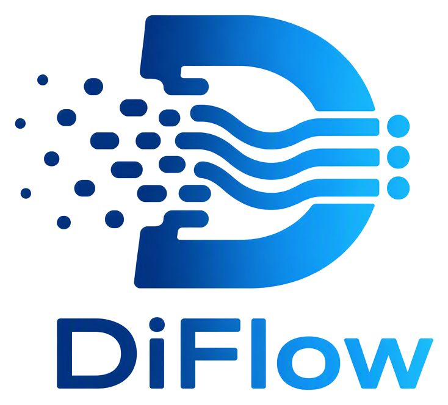

<div align="center" id="diflowtop">
  <h3>
    <picture>
      <source media="(prefers-color-scheme: dark)" srcset="assets/DiFlow-logo-dark.png">
      
    </picture><br>
    Turn complex diffusion workflows into efficient, scalable and modular services.
  </h3>
</div>

--------------------------------------------------------------------------------

## News

- [2026/07] 🔥 DiFlow has been accepted by ACM SOSP 2026.

## About

DiFlow is a serving system for building and running diffusion workflows at scale.

Traditional serving systems deploy each diffusion workflow as a monolithic unit, coupling all of its models to the same lifecycle and resource configuration. DiFlow takes a different approach: it **micro-serves** diffusion workflows by decomposing them into independently managed model-execution nodes and scheduling those nodes across a GPU cluster.

With DiFlow, you can:

- **Compose workflows naturally.** Build diffusion workflows in Python with reusable models, adapters, loops, and request-dependent control flow.
- **Share and scale models independently.** Reuse common models across workflows and scale bottlenecks without replicating an entire workflow.
- **Adapt execution to the cluster.** Schedule model executions and adjust parallelism according to runtime GPU availability.

## Getting Started

- [Install DiFlow](./docs/installation.md)
- [Quick Start](./docs/quickstart.md)

## Contributing

We welcome contributions and collaborations. See [Contributing to DiFlow](./CONTRIBUTING.md) for more information.

## Citation

If DiFlow is useful for your research, please cite our paper.

```bibtex
@inproceedings{DiFlow2026,
  title = {DiFlow: A System for Micro-Serving Text-to-Image Diffusion Workflows},
  author = {Yang, Lingyun and Li, Suyi and Feng, Tianyu and Jiang, Xiaoxiao and Di, Zhipeng and Lu, Weiyi and Liu, Kan and Yu, Yinghao and Lan, Tao and Yang, Guodong and Qu, Lin and Zhang, Liping and Wang, Wei},
  booktitle = {Proc. ACM SOSP},
  year = {2026}
}
```


## Acknowledgements

We thank the contributors of [🤗 Diffusers](https://github.com/huggingface/diffusers) for their foundational work.

## Contact

For questions and support, please open an issue or contact the authors.

## License

DiFlow is licensed under the [Apache License 2.0](LICENSE).
